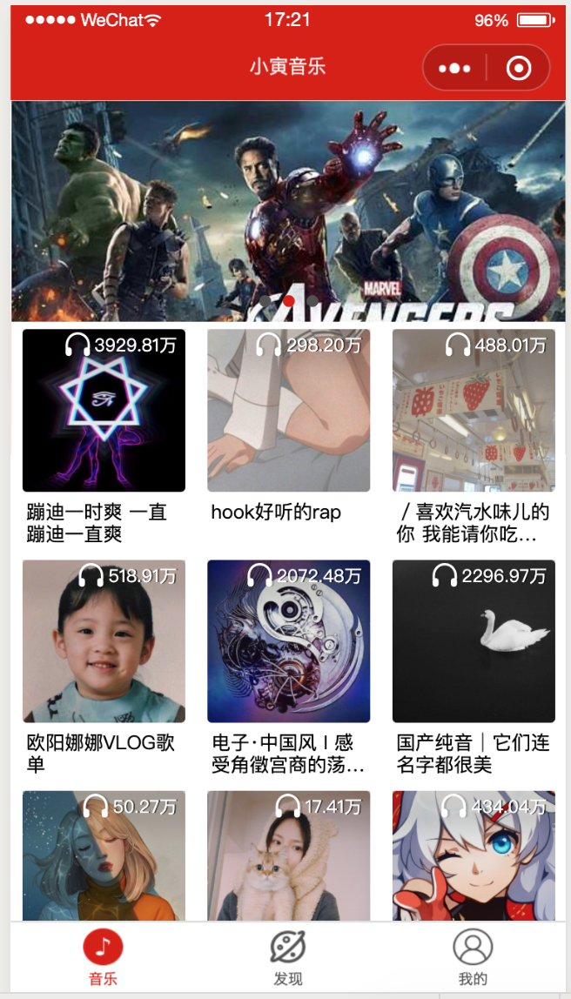
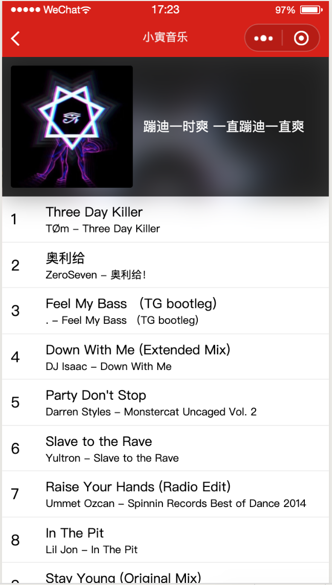
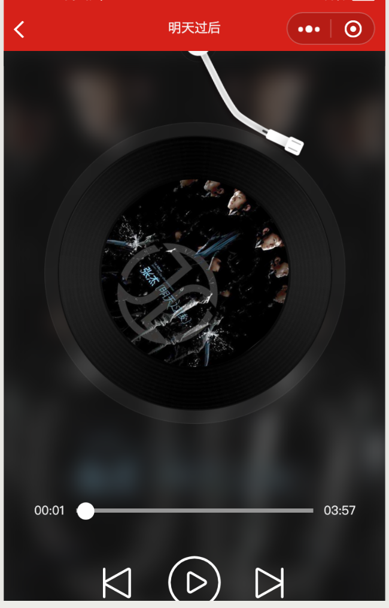
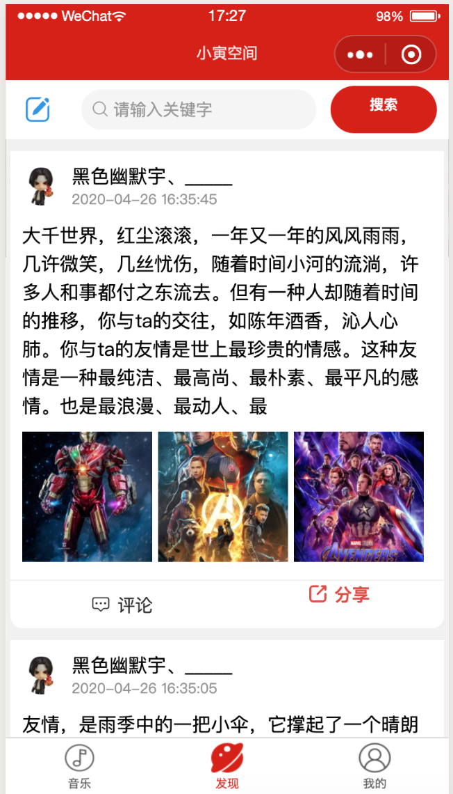
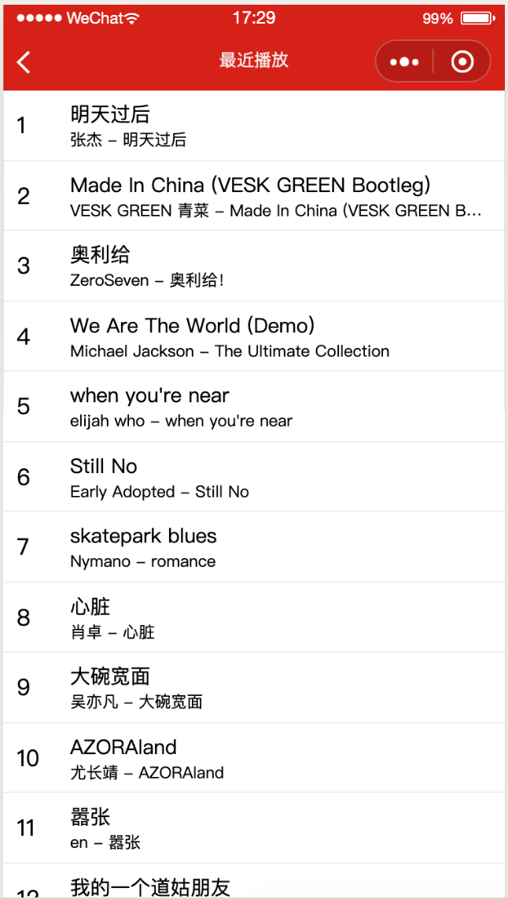
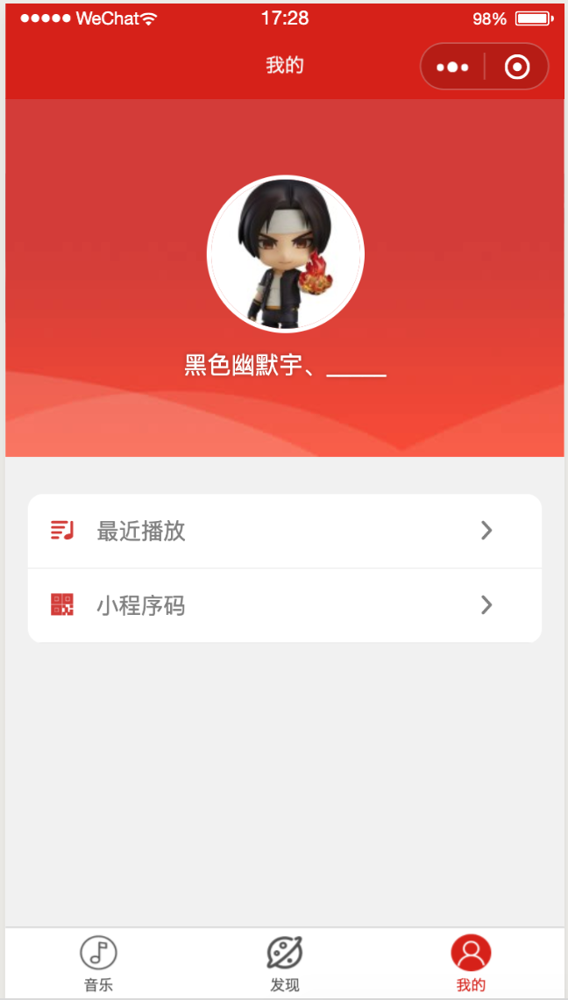

# 微信小程序云音乐
> 使用微信小程序原生开发，包括云开发环境

这是云开发的快速启动指引，其中演示了如何上手使用云开发的三大基础能力：

- 数据库：一个既可在小程序前端操作，也能在云函数中读写的 JSON 文档型数据库
- 文件存储：在小程序前端直接上传/下载云端文件，在云开发控制台可视化管理
- 云函数：在云端运行的代码，微信私有协议天然鉴权，开发者只需编写业务逻辑代码

### 屏幕截图

